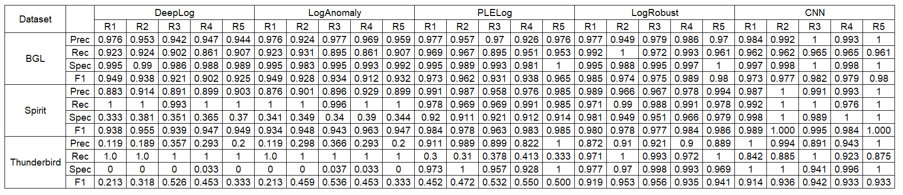
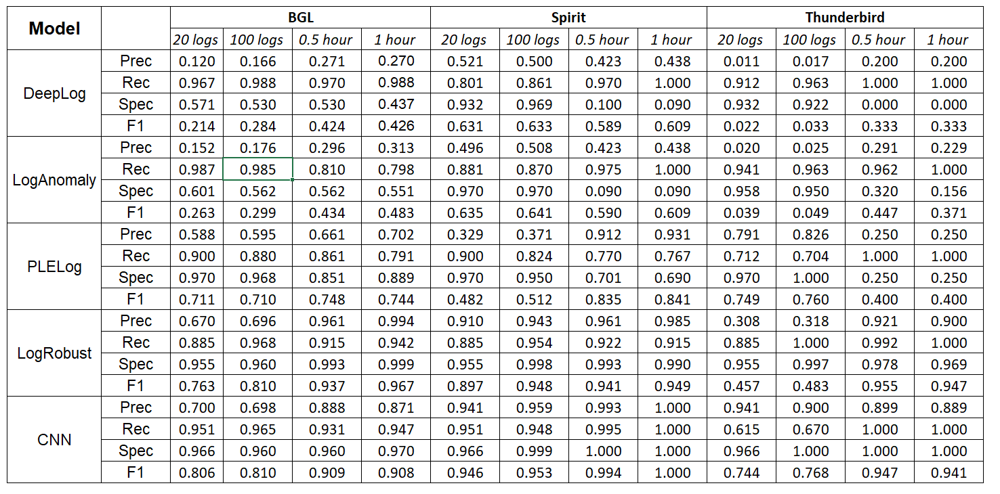
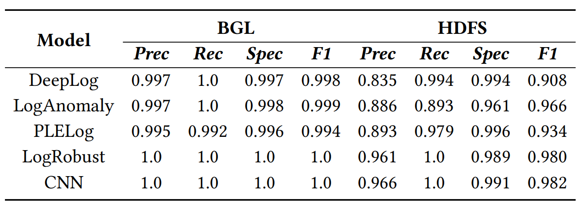
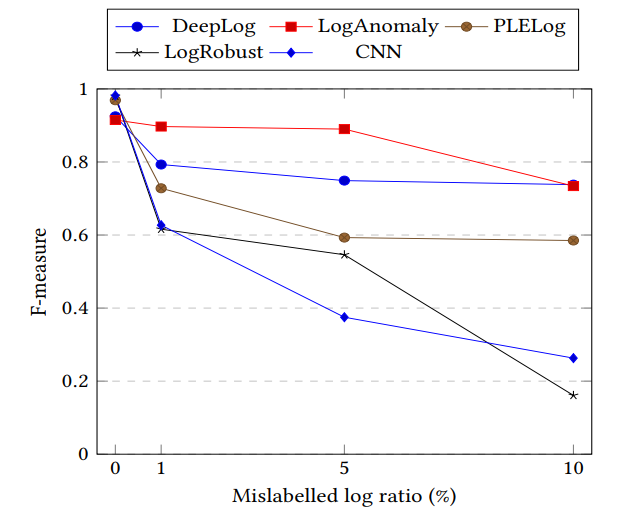
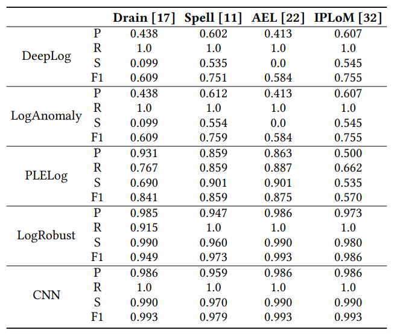
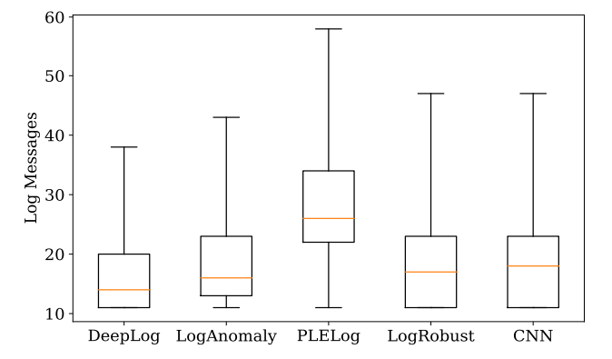

## Log-based Anomaly Detection with Deep Learning: How Far Are We?
**Abstract**: Software-intensive systems produce logs for troubleshooting purposes. Recently, many deep learning models
 have been proposed to automatically detect system anomalies based on log data. These models typically claim very high detection accuracy. For example, most models report an F-measure greater than 0.9 on the commonly-used HDFS dataset. To achieve a profound understanding of how far we are from solving the problem of log-based anomaly detection, in this paper, we conduct an in-depth analysis of five state-of-the-art deep learning-based models for detecting system anomalies on four public log datasets. Our experiments focus on several aspects of model evaluation, including training data selection, data grouping, class distribution, data noise, and early detection ability. Our results point out that all these aspects have significant impact on the evaluation, and that all the studied models do not always work well. The problem of log-based anomaly detection has not been solved yet. Based on our findings, we also suggest possible future work.
This repository provides the implementation of recent log-based anomaly detection methods.

### I. Studied Models
| Model | Paper |
| :--- | :--- |
| DeepLog | [DeepLog: Anomaly Detection and Diagnosis from System Logs through Deep Learning](https://dl.acm.org/doi/abs/10.1145/3133956.3134015) |
| LogAnomaly | [LogAnomaly: Unsupervised Detection of Sequential and Quantitative Anomalies in Unstructured Logs](https://www.ijcai.org/proceedings/2019/658) |
| PLELog | [Semi-Supervised Log-Based Anomaly Detection via Probabilistic Label Estimation](https://ieeexplore.ieee.org/document/9401970/) |
| LogRobust | [Robust log-based anomaly detection on unstable log data](https://dl.acm.org/doi/10.1145/3338906.3338931) |
| CNN | [Detecting Anomaly in Big Data System Logs Using Convolutional Neural Network](https://ieeexplore.ieee.org/document/8511880) |

### II. Requirements
- Python 3
- NVIDIA GPU + CUDA cuDNN
- PyTorch 1.7.0
  
The required packages are listed in requirements.txt. Install:

```
pip install -r requirements.txt
```

### III. Data and Results
BGL and HDFS datasets can be found here: [Loghub](https://zenodo.org/record/3227177).
Our Spirit and Thunderbird datasets can be found here: [Raw data](https://figshare.com/s/4d2e5634c5b94a6e64f6).

The data after log parsing can be found here (for all 4 datasets): [Parsed data](https://figshare.com/s/8e367db4d98cf39203c5)

Training/Testing data and pre-trained models for each RQ can be found here: [Results](https://figshare.com/s/7c61dd5547730bce41b8)
#### 1.  RQ1: How do the existing models perform with different training data selection strategies?
- Chronological selection:

|   Dataset   |   | DeepLog | LogAnomaly | LogRobust |  CNN  | PLELog |
|:-----------:|---|:-------:|:----------:|:---------:|:-----:|:------:|
|     BGL     | P |  0.270  |    0.313   |   0.994   | 0.871 |  0.702 |
|             | R |  0.988  |    0.798   |   0.942   | 0.947 |  0.791 |
|             | S |  0.437  |    0.551   |   0.999   | 0.970 |  0.899 |
|             | F |  0.426  |    0.483   |   0.967   | 0.908 |  0.744 |
|    Spirit   | P |  0.438  |    0.438   |   0.985   | 0.986 |  0.931 |
|             | R |   1.0   |     1.0    |   0.915   |  1.0  |  0.767 |
|             | S |  0.090  |    0.090   |   0.990   | 0.990 |  0.690 |
|             | F |  0.609  |    0.609   |   0.949   | 0.993 |  0.841 |
| Thunderbird | P |  0.200  |    0.229   |   0.900   | 0.889 |  0.900 |
|             | R |   1.0   |     1.0    |    1.0    |  1.0  |   1.0  |
|             | S |    0    |    0.156   |   0.969   | 0.969 |  0.250 |
|             | F |  0.333  |    0.371   |   0.947   | 0.941 |  0.400 |

- Random selection:



R1, R2, etc. stand for round 1, round 2, etc. of random selection strategies. 

#### 2. RQ2: How do the existing models perform with different data grouping methods?
- Fixed-window grouping:



- Session-window grouping:



#### 3.  RQ3: How do the existing approaches perform with different class distributions?

- Different class distributions on the HDFS dataset:


#### 4. RQ4: Can existing methods work with different degrees of data noise?
- The impact of mislabelled logs on the HDFS dataset:



- The impact of log parsing errors on the Spirit dataset:



Full results will be available soon...
#### RQ5: How early can the existing models detect anomalies in online detection?
- The number of examined log messages before each model can detect an anomaly:


Full results will be available soon...

### IV. Demo
- Example of DeepLog on BGL with fixed window size of 1 hour:
```shell script
python main_run.py --folder=bgl/ --log_file=BGL.log --dataset_name=bgl --model_name=deeplog --window_type=sliding
 --sample=sliding_window --is_logkey --train_size=0.8 --train_ratio=1 --valid_ratio=0.1 --test_ratio=1 --max_epoch=100
 --n_warm_up_epoch=0 --n_epochs_stop=10 --batch_size=1024 --num_candidates=150 --history_size=10 --lr=0.001
 --accumulation_step=5 --session_level=hour --window_size=60 --step_size=60 --output_dir=experimental_results/demo
/random/ --is_process
```
- For more explanation of parameters:
```shell script
python main_run.py --help
```

### V. Hyperparameters
All hyperpameters can be found in file parameters.txt in [Results](https://figshare.com/s/7c61dd5547730bce41b8). The
 hyperparameters are fine-tuned for each dataset.